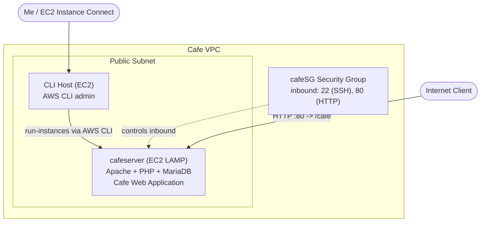

# Troubleshooting the Creation of an EC2 Instance

A hands-on troubleshooting lab where I used the **AWS CLI** to launch an Amazon EC2 instance from a provided shell script, then found and fixed the bugs that stopped it from working. The script deploys a **LAMP stack** (Linux, Apache, MariaDB, PHP) via user data to host the **Café Web Application**. I used basic troubleshooting techniques and the open-source **nmap** port scanner to diagnose why the site wouldn't load.

## Overview

I was given a bash script (`create-lamp-instance-v2.sh`) that provisions an EC2 instance and configures it as a LAMP web server using a user data file. The script intentionally contained bugs. My job was to run it, read the errors, locate the root cause of each issue in the script, fix it, and re-run until the Café website came up and could take orders.

## Architecture

I drove everything from a pre-provisioned **CLI Host** instance using the AWS CLI. The script discovers the *Cafe VPC*, creates a security group, and launches a single LAMP instance in that VPC. The instance runs Apache/PHP with a local MariaDB database, and its user data script downloads and deploys the Café Web Application.



## Skills Demonstrated

- Launching an EC2 instance by using the **AWS CLI** (`run-instances`)
- Reading and reasoning about a provisioning **bash script**
- Understanding that **AMI IDs are Region-specific**
- Diagnosing connectivity with the open-source **nmap** utility
- Fixing **security group** inbound rules to allow HTTP traffic
- Verifying a **user data** deployment via `cloud-init-output.log`

## Tasks

### Task 1: Connect to the CLI Host
Connected to the pre-provisioned **CLI Host** instance using **EC2 Instance Connect**. This is the machine I used to run all AWS CLI commands.

### Task 2: Configure the AWS CLI
Configured credentials with `aws configure`, supplying the lab's Access Key, Secret Key, and Region, with `json` as the default output format. (Since I didn't name a profile, everything saved to the **default** profile, so no `--profile` flag was needed on manual commands.)

### Task 3: Create the instance and troubleshoot
Backed up the script first (good practice), reviewed it in `vi`, then ran it and worked through the failures.

```bash
cd ~/sysops-activity-files/starters
cp create-lamp-instance-v2.sh create-lamp-instance.backup
./create-lamp-instance-v2.sh
```

## Issues I Found and Fixed

### Issue #1 — `InvalidAMIID.NotFound` (Region mismatch)

The script failed with:

```
An error occurred (InvalidAMIID.NotFound) when calling the RunInstances operation:
The image id '[ami-xxxxxxxxxx]' does not exist
```

**Root cause:** AMI IDs are unique per Region. The script looked up the AMI in the discovered VPC Region (`$region`), but the `run-instances` call had the Region **hardcoded** to `us-east-1`, so the AMI didn't exist in the launch Region.

```bash
# create-lamp-instance-v2.sh — run-instances call

# Before (line 160):
--region us-east-1 \

# After:
--region $region \
```

> The AMI lookup on line 54 already used `--region $region`, and line 155 even echoes
> `"Creating an EC2 instance in "$region` — so the hardcoded Region on the launch call
> was both wrong and inconsistent with the rest of the script. Making them all use
> `$region` resolved the error, and `run-instances` succeeded with a public IPv4 address.

### Issue #2 — Website won't load (wrong port in security group)

After the instance launched, `http://<public-ip>` wouldn't load. I installed and ran nmap from the CLI Host to see what was actually reachable:

```bash
sudo yum install -y nmap
nmap -Pn <public-ip>
```

The scan showed SSH (22) open but **port 80 was not accessible** — even though Apache (`httpd`) listens on port 80.

**Root cause:** The block that was *supposed* to open port 80 opened **port 8080** instead. The web server was fine; inbound HTTP was simply blocked.

```bash
# create-lamp-instance-v2.sh — security group ingress

# Before (line 149):
--port 8080 \

# After:
--port 80 \
```

I resolved it by adding the missing **inbound HTTP (port 80)** rule to the instance's `cafeSG` security group (via the EC2 console: *Security group → Edit inbound rules → Add rule → Type: HTTP, Source: Anywhere-IPv4*). Re-running `nmap -Pn <public-ip>` then showed **80/tcp open**.

> Verify the web server too: `sudo systemctl status httpd` (and `sudo systemctl start httpd`
> if it isn't active). In my case the service was running — the only problem was the
> blocked port.

After the fix, `http://<public-ip>` returned **"Hello From Your Web Server!"** I confirmed the user data ran cleanly by tailing the cloud-init log:

```bash
sudo tail -f /var/log/cloud-init-output.log   # look for "Create Database script completed"
```

### Task 4: Verify the website
Browsed to `http://<public-ip>/cafe`, loaded the café home page, placed several dessert orders, and confirmed both orders appeared on the **Order History** page — proving the app and its local MariaDB database were working end to end.

## Key Takeaways

- **AMI IDs are Region-specific.** An AMI looked up in one Region won't launch in another — keep the AMI lookup and `run-instances` in the *same* Region. Prefer a variable over a hardcoded Region.
- **`InvalidAMIID.NotFound` often means a Region mismatch**, not a missing image.
- **nmap is a fast way to confirm reachability.** Scanning the public IP quickly showed that port 80 was the problem, not the web server.
- **Match the security group port to the service.** Apache serves on 80; opening 8080 leaves HTTP blocked. The fix was an inbound HTTP rule on the security group.
- **Back up before you edit,** and use error messages to point you straight to the offending line.
