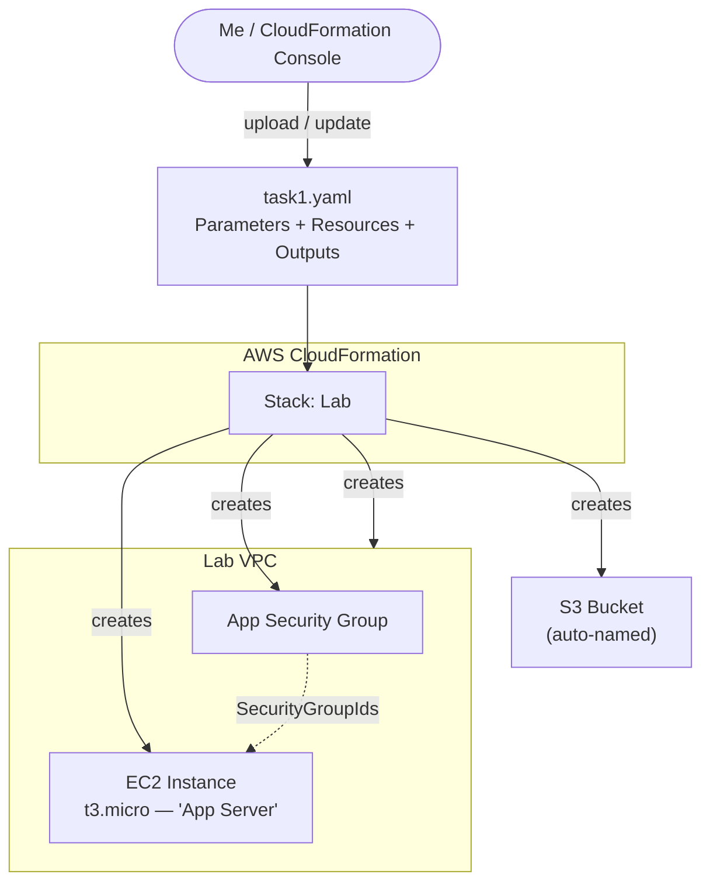

# Automation with CloudFormation

A hands-on lab where I used **AWS CloudFormation** to define infrastructure as code and deploy it as a repeatable, automated stack. Rather than following pre-defined steps, the lab was interactive: I had to consult the CloudFormation documentation and author the template resources myself. I deployed a VPC and Security Group, then progressively added an **Amazon S3 bucket** and an **Amazon EC2 instance** by editing the template and updating the stack in place.

## Overview

Deploying infrastructure consistently and reliably is hard when it depends on people following documented procedures without shortcuts, and it is even harder out-of-hours when fewer staff are available. CloudFormation solves this by defining infrastructure in a **template** that can be deployed automatically and repeatably.

I worked with a YAML template built from three key sections:

- **Parameters** — prompts for inputs used elsewhere in the template (here, two CIDR ranges for the VPC and subnet).
- **Resources** — the infrastructure to deploy (VPC and Security Group to start with).
- **Outputs** — selective information about resources in the stack (here, the default Security Group of the created VPC).

Templates can be written in **YAML** (used here) or **JSON**. In YAML the formatting matters: indentation and hyphens are significant, and I used two spaces per indent level throughout.

## Architecture

I authored a single template (`task1.yaml`) and deployed it as one CloudFormation stack named **Lab**. CloudFormation worked out the correct order to create resources (for example, creating the VPC before resources that depend on it), and it added new resources on stack updates without redeploying the unchanged ones.



## Skills Demonstrated

- Deploying infrastructure as code with an **AWS CloudFormation** template
- Understanding the **Parameters**, **Resources**, and **Outputs** sections of a template
- Authoring **YAML** resources by consulting AWS documentation (not copying a solution)
- Updating an existing stack in place and previewing changes before applying them
- Referencing resources within a template using the **`!Ref`** intrinsic function
- Retrieving the latest AMI via **AWS Systems Manager Parameter Store**
- Cleanly deleting a stack and all the resources it created

## Tasks

### Task 1: Deploy a CloudFormation stack

I reviewed the provided `task1.yaml` template, noting the Parameters (two CIDR ranges), Resources (VPC + Security Group), and Outputs (default Security Group) sections.

- In the **CloudFormation** console I chose **Create stack** → **Upload a template file** and uploaded `task1.yaml`.
- I set the **Stack name** to `Lab` and accepted the default parameter values (the CIDR ranges).
- On the Review page I acknowledged that the template uses custom resource names, then chose **Create stack**.
- I watched the **Events** tab (shown in reverse order) as CloudFormation created each resource, and the **Resources** tab to see what was being provisioned.
- I waited for the status to reach **CREATE_COMPLETE**, refreshing occasionally.

> The Events tab is where any creation errors surface, and CloudFormation automatically determines the optimal creation order (for example, the VPC before the subnet).

### Task 2: Add an Amazon S3 bucket to the stack

My objective was to edit the template to add an S3 bucket, then update the stack. Using the **Amazon S3 Template Snippets** documentation, I added the bucket under the `Resources:` header. The correct solution needs only two lines — an identifier and a `Type`, with no `Properties` required:

```yaml
  MyBucket:
    Type: AWS::S3::Bucket
```

- In the console I selected the **Lab** stack, chose **Update** → **Replace current template** → **Upload a template file**, and uploaded my edited `task1.yaml`.
- I clicked through the stack details and options pages, then waited for CloudFormation to calculate the change set.
- The preview showed CloudFormation would **Add** an S3 bucket while leaving all other resources unchanged.
- I chose **Update stack** and waited for **UPDATE_COMPLETE**, then confirmed the bucket (with a CloudFormation-assigned random name) appeared on the **Resources** tab.

> Because the existing resources didn't need to be redeployed, adding a new resource to a live stack was fast — a good illustration of how incremental stack updates work.

### Task 3: Add an Amazon EC2 instance to the stack

Defining an EC2 instance is more involved than the bucket because it references associated resources (AMI, security group, subnet). First I added a special parameter to the **Parameters** section to fetch the latest Amazon Linux 2 AMI from **Systems Manager Parameter Store**:

```yaml
  AmazonLinuxAMIID:
    Type: AWS::SSM::Parameter::Value<AWS::EC2::Image::Id>
    Default: /aws/service/ami-amazon-linux-latest/amzn2-ami-hvm-x86_64-gp2
```

> This retrieves the correct AMI ID for the stack's Region automatically, so the same template can deploy in different Regions without hardcoding an AMI ID per Region.

Then, using the **`AWS::EC2::Instance`** documentation (YAML version), I added the instance under `Resources:` with only the five required properties, using `!Ref` to reference the other template resources:

```yaml
  AppServer:
    Type: AWS::EC2::Instance
    Properties:
      ImageId: !Ref AmazonLinuxAMIID
      InstanceType: t3.micro
      SecurityGroupIds:
        - !Ref AppSecurityGroup
      SubnetId: !Ref PublicSubnet
      Tags:
        - Key: Name
          Value: App Server
```

- Note that `SecurityGroupIds` expects a **list**, so the security group is provided as a list item (`- !Ref AppSecurityGroup`).
- I updated the stack again with the revised template, confirmed the preview showed the EC2 instance being added, and applied the update.
- The **App Server** instance then appeared on the **Resources** tab.

### Task 4: Delete the stack

- In the console I selected the **Lab** stack, chose **Delete**, and confirmed with **Delete stack**.
- The stack showed **DELETE_IN_PROGRESS** and, after a few minutes, disappeared.
- CloudFormation automatically deleted every resource it had created — the VPC, Security Group, S3 bucket, and EC2 instance — so there was no manual cleanup.

## Issue I Found and Fixed

### `ImageID` vs `ImageId` — YAML property names are case-sensitive

Because I wrote the EC2 resource myself instead of using the sample solution, I initially typed the property as **`ImageID:`** (capital `D`). The stack update failed — CloudFormation didn't recognize `ImageID` as a valid property of `AWS::EC2::Instance`.

```yaml
# Before (failed): property name not recognized
      ImageID: !Ref AmazonLinuxAMIID

# After (succeeded): correct casing
      ImageId: !Ref AmazonLinuxAMIID
```

**Root cause:** CloudFormation resource property names are **case-sensitive** and must match the schema exactly. The correct property is `ImageId` (lowercase `d`). After fixing the casing, the stack update completed successfully and the App Server was created.

> Lesson learned: when authoring templates by hand, match the documented property names character-for-character — a single wrong capital letter is enough to fail the update.

## Key Takeaways

- **Infrastructure as code is repeatable and automatable.** A single template can deploy an entire environment consistently, even on a schedule and out-of-hours.
- **Templates have a clear structure.** Parameters take inputs, Resources define infrastructure, and Outputs expose selected values.
- **YAML is whitespace- and case-sensitive.** Indentation, hyphens, and exact property casing (`ImageId`, not `ImageID`) all matter.
- **`!Ref` wires resources together.** It lets one resource reference another (or a parameter) within the same template.
- **SSM Parameter Store keeps AMIs current and portable.** Fetching the latest Amazon Linux AMI by parameter avoids hardcoding Region-specific AMI IDs.
- **Stack updates are incremental.** CloudFormation previews changes and only adds/modifies what changed, leaving unaffected resources in place.
- **Deletion is clean.** Deleting the stack removes all the resources it created, avoiding orphaned infrastructure.
