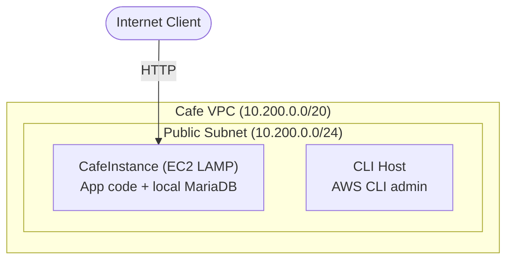
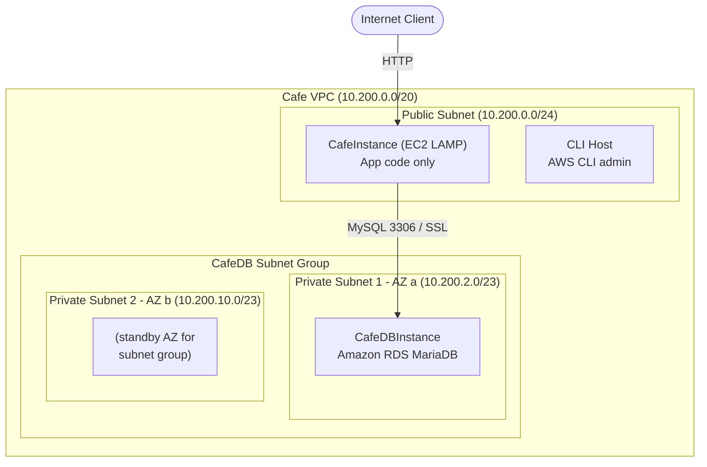

# Migrating to Amazon RDS

A hands-on lab where I migrated a café web application from a local MySQL/MariaDB database (running on an EC2 instance) to a fully managed **Amazon RDS** MariaDB instance.

## Overview

The café application originally ran its database locally on a LAMP EC2 instance alongside the application code. In this lab I stood up a managed Amazon RDS instance, migrated the existing data into it, and reconfigured the application to point at the new database with zero changes to the application code itself.

## Architecture

**Before migration**
- Single EC2 (T3 small) LAMP instance in a **public subnet**, hosting both the app code and the MariaDB database.
- A CLI Host instance in the same subnet for administration via the AWS CLI.

**After migration**
- The database moved to a managed **Amazon RDS MariaDB** instance in the same VPC.
- The RDS instance lives in **private subnets** across two Availability Zones, isolated from the internet.
- The application connects to RDS over the MySQL protocol, secured by a dedicated security group.

### Before migration



### After migration



## Skills Demonstrated

- Creating an Amazon RDS MariaDB instance using the **AWS CLI**
- Migrating data from a MariaDB database on EC2 to Amazon RDS
- Monitoring the RDS instance using **Amazon CloudWatch** metrics
- Working with VPCs, subnets, subnet groups, and security groups
- Externalized configuration using **AWS Systems Manager Parameter Store**

## What I Built

| Component | Description |
|---|---|
| `CafeDatabaseSG` | Security group for the RDS instance (inbound MySQL/TCP 3306 from the app security group only) |
| `CafeDB Private Subnet 1` | Private subnet in the app's AZ (`10.200.2.0/23`) |
| `CafeDB Private Subnet 2` | Private subnet in a second AZ (`10.200.10.0/23`) |
| `CafeDB Subnet Group` | DB subnet group spanning both private subnets |
| `CafeDBInstance` | RDS MariaDB instance (`db.t3.micro`, 20 GB, MariaDB 10.11.11) |

## Steps

### 1. Generate order data
Placed orders on the café website to create real data in the local database before migrating.

### 2. Create the RDS instance (AWS CLI)
Connected to the CLI Host via EC2 Instance Connect, configured the AWS CLI, then created the prerequisite networking and the RDS instance.

```bash
# Create the database security group
aws ec2 create-security-group \
  --group-name CafeDatabaseSG \
  --description "Security group for Cafe database" \
  --vpc-id <CafeInstance VPC ID>

# Allow MySQL (3306) only from the app's security group
aws ec2 authorize-security-group-ingress \
  --group-id <CafeDatabaseSG Group ID> \
  --protocol tcp --port 3306 \
  --source-group <CafeSecurityGroup Group ID>

# Create two private subnets in different AZs
aws ec2 create-subnet \
  --vpc-id <CafeInstance VPC ID> \
  --cidr-block 10.200.2.0/23 \
  --availability-zone <CafeInstance AZ>

aws ec2 create-subnet \
  --vpc-id <CafeInstance VPC ID> \
  --cidr-block 10.200.10.0/23 \
  --availability-zone <second AZ>

# Group the subnets into a DB subnet group
aws rds create-db-subnet-group \
  --db-subnet-group-name "CafeDB Subnet Group" \
  --db-subnet-group-description "DB subnet group for Cafe" \
  --subnet-ids <Private Subnet 1 ID> <Private Subnet 2 ID> \
  --tags "Key=Name,Value=CafeDatabaseSubnetGroup"

# Create the RDS MariaDB instance
aws rds create-db-instance \
  --db-instance-identifier CafeDBInstance \
  --engine mariadb \
  --engine-version 10.11.11 \
  --db-instance-class db.t3.micro \
  --allocated-storage 20 \
  --availability-zone <CafeInstance AZ> \
  --db-subnet-group-name "CafeDB Subnet Group" \
  --vpc-security-group-ids <CafeDatabaseSG Group ID> \
  --no-publicly-accessible \
  --master-username root --master-user-password '<password>'
```

Monitored the instance until its status reached `available`, then recorded the endpoint address:

```bash
aws rds describe-db-instances \
  --db-instance-identifier CafeDBInstance \
  --query "DBInstances[*].[Endpoint.Address,AvailabilityZone,PreferredBackupWindow,BackupRetentionPeriod,DBInstanceStatus]"
```

### 3. Migrate the data
Backed up the local database with `mysqldump` and restored it into RDS over an encrypted connection.

```bash
# Back up the local database
mysqldump --user=root --password='<password>' \
  --databases cafe_db --add-drop-database > cafedb-backup.sql

# RDS requires SSL/TLS — download the RDS CA bundle
curl -o global-bundle.pem https://truststore.pki.rds.amazonaws.com/global/global-bundle.pem

# Restore into RDS
mysql --user=root --password='<password>' \
  --host=<RDS Endpoint Address> \
  --ssl-ca=./global-bundle.pem \
  < cafedb-backup.sql

# Verify the data migrated correctly
mysql --user=root --password='<password>' \
  --host=<RDS Endpoint Address> \
  --ssl-ca=./global-bundle.pem \
  cafe_db -e "select * from product;"
```

### 4. Point the app at RDS
Because the database URL was externalized in **Systems Manager Parameter Store**, switching databases required no code changes — just updating the `/cafe/dbUrl` parameter with the RDS endpoint address. Confirmed the app worked by checking that the order count matched pre-migration.

### 5. Monitor with CloudWatch
Reviewed RDS metrics in the console (`CPUUtilization`, `DatabaseConnections`, `FreeStorageSpace`, `FreeableMemory`, `WriteIOPS`, `ReadIOPS`) and watched `DatabaseConnections` rise to 1 when opening an interactive SQL session and drop back to 0 on exit.

## Key Takeaways

- **Managed databases reduce operational overhead** — automated backups (default 1-day retention, 30-minute backup window), monitoring, and patching come out of the box.
- **Externalizing config pays off** — storing the DB URL in Parameter Store made the migration a one-parameter change with no redeploy.
- **Security by design** — placing RDS in private subnets with a tightly scoped security group keeps the database off the public internet.
- **RDS enforces encryption in transit** by requiring SSL/TLS connections with the RDS CA bundle.
