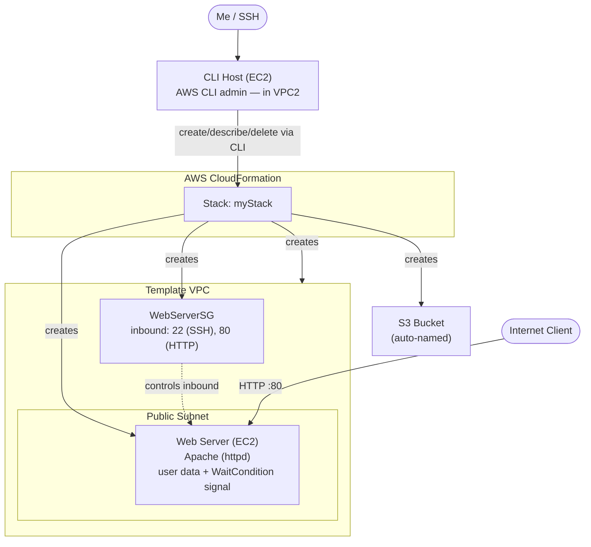

# Troubleshooting CloudFormation

A hands-on troubleshooting lab where I used the **AWS CLI** to create, inspect, and delete an **AWS CloudFormation** stack, and worked through the failures along the way. I diagnosed a failed `create-stack` by reading EC2 user data logs, practiced **drift detection** after making a manual change, and solved a `delete-stack` failure by retaining an S3 bucket that still contained objects. I also warmed up by querying JSON with **JMESPath**, the same expression language the AWS CLI `--query` parameter uses.

## Overview

CloudFormation deploys infrastructure as code, but deployments still fail. Common causes include bad user data, drift from manual changes, and resources that block deletion. This lab was about troubleshooting those situations from the command line rather than authoring a template from scratch. I played the role of Sofîa building a proof of concept: a web server inside a custom VPC, defined entirely in a template and deployed via the AWS CLI.

I worked from a pre-provisioned **CLI Host** EC2 instance, using `template1.yaml` which creates a VPC with a public subnet, an EC2 web server, a WaitCondition and WaitHandle pair, an S3 bucket, and a security group.

## Architecture

Everything was driven from the **CLI Host** in VPC2 using the AWS CLI. The `create-stack` command deploys a second, self-contained environment defined by the template, with its own VPC, subnet, web server, S3 bucket, and security group. The **WaitCondition** is the key control. It waits for the EC2 user data script to signal success, and fails the whole stack if that signal never arrives.



## Skills Demonstrated

- Querying JSON documents with **JMESPath** using indexes, attributes, multi-select, and filters
- Creating and inspecting stacks with the **AWS CLI** (`create-stack`, `describe-stacks`, `describe-stack-resources`, `describe-stack-events`)
- Reading `describe-stack-events` to isolate `CREATE_FAILED` events with a `--query` filter
- Using **`--on-failure DO_NOTHING`** to prevent rollback so failed resources can be inspected
- Diagnosing a **user data** failure via `/var/log/cloud-init-output.log` and the `part-001` script
- Detecting and interpreting **stack drift** after a manual change
- Solving a `DELETE_FAILED` by using **`--retain-resources`** with a logical resource ID

## Tasks

### Task 1: Query JSON with JMESPath

Practiced on [jmespath.org](https://jmespath.org/) against a small `desserts` document, then a CloudFormation `StackResources` document:

| Expression | Returns |
|---|---|
| `desserts[1]` | the second array element, since indexes start at 0 |
| `desserts[0].name` | the `name` attribute of the first element |
| `desserts[0].[name,price]` | a multi-select list of two attributes |
| `desserts[].name` | the `name` of every element |
| `desserts[?name=='Carrot cake']` | a filter expression that needs no index |

The finale was to retrieve the logical ID of the EC2 instance resource by type:

```
StackResources[?ResourceType == 'AWS::EC2::Instance'].LogicalResourceId
```

This is exactly the pattern the AWS CLI `--query` parameter uses, so the rest of the lab was applied JMESPath.

### Task 2: Create a stack and troubleshoot the failure

Reviewed `template1.yaml` with `less`, then created the stack and watched resource status live:

```bash
aws cloudformation create-stack \
--stack-name myStack \
--template-body file://template1.yaml \
--capabilities CAPABILITY_NAMED_IAM \
--parameters ParameterKey=KeyName,ParameterValue=vockey

watch -n 5 -d aws cloudformation describe-stack-resources \
--stack-name myStack \
--query 'StackResources[*].[ResourceType,ResourceStatus]' \
--output table
```

Almost all resources created, then began deleting, and the stack rolled back to `ROLLBACK_COMPLETE`. Isolating the failure:

```bash
aws cloudformation describe-stack-events \
--stack-name myStack \
--query "StackEvents[?ResourceStatus == 'CREATE_FAILED']"
```

The `ResourceStatusReason` showed the **WaitCondition timed out**. The problem was that rollback had already deleted the EC2 instance, so I couldn't read its logs. I deleted the leftover stack object with `delete-stack` and moved on.

### Task 2.4: Avoid rollback to inspect logs

Re-created the stack with **`--on-failure DO_NOTHING`** so failed resources would be left in place:

```bash
aws cloudformation create-stack \
--stack-name myStack \
--template-body file://template1.yaml \
--capabilities CAPABILITY_NAMED_IAM \
--on-failure DO_NOTHING \
--parameters ParameterKey=KeyName,ParameterValue=vockey
```

This time the stack reached `CREATE_FAILED` without rolling back, so the Web Server instance survived. I grabbed its public IP and SSH'd in to read the logs, described in the issue below.

### Task 3: Make a manual change and detect drift

After fixing the template in Task 2.5 and getting a healthy stack, I intentionally introduced drift. In the console I changed the **WebServerSG** SSH port 22 inbound rule from `0.0.0.0/0` to **My IP**. I also uploaded an object to the stack's S3 bucket.

```bash
aws cloudformation detect-stack-drift --stack-name myStack
# then poll with the returned ID:
aws cloudformation describe-stack-drift-detection-status \
--stack-drift-detection-id <driftId>

aws cloudformation describe-stack-resources \
--stack-name myStack \
--query 'StackResources[*].[ResourceType,ResourceStatus,DriftInformation.StackResourceDriftStatus]' \
--output table
```

The overall status was `DRIFTED`. The security group showed **`MODIFIED`** while everything else was `IN_SYNC`. Notably the S3 bucket stayed `IN_SYNC`, because adding objects to a bucket is not drift. Only changing a resource property counts. Filtering to the modified resource showed port 22 now open only to my IP instead of the template's `0.0.0.0/0`. An `update-stack` does not auto-resolve drift, so it must be reconciled manually.

### Task 4: Delete the stack and the challenge

A plain `delete-stack` left the stack at `DELETE_FAILED` because the S3 bucket still contained objects. CloudFormation won't delete a non-empty bucket, to guard against data loss. The fix is described in the second issue below.

## Issues I Found and Fixed

### Issue #1 — WaitCondition timeout caused by `http` vs `httpd`

With rollback disabled, I SSH'd into the Web Server and read the user data log:

```bash
sudo tail -50 /var/log/cloud-init-output.log
sudo cat /var/lib/cloud/instance/scripts/part-001
```

The log showed **`No package http available`** and `util.py[WARNING]: Failed running .../part-001`.

**Root cause:** the user data tried to install `http`, but the Apache package is named **`httpd`**. Because the script's shebang used `-e` to exit immediately on any error, the failed install aborted the whole script, so the WaitCondition never received its success signal and timed out after 2 minutes, failing the stack.

```yaml
# template1.yaml — user data (line ~128)

# Before (failed): wrong package name
yum install -y http

# After (succeeded): correct Apache package
yum install -y httpd
```

After fixing the name, deleting the failed stack, and re-creating it, the stack reached **`CREATE_COMPLETE`** and `http://<public-ip>` returned **"Hello from your web server!"**

One permissions gotcha is worth noting. The lab shows `tail -50 /var/log/cloud-init-output.log` without `sudo`, but the file is root-owned, so I needed `sudo tail` to read it.

### Issue #2 — `DELETE_FAILED`: can't delete a non-empty S3 bucket

```
StackStatusReason: The following resource(s) failed to delete: [MyBucket].
```

**Root cause:** CloudFormation refuses to delete an S3 bucket that still contains objects. I didn't want to empty the bucket, because in a real scenario other systems may already depend on its contents and name, so the fix was to retain it during deletion.

First I found the bucket's logical ID rather than its physical name, using the same JMESPath skill from Task 1:

```bash
aws cloudformation describe-stack-resources \
--stack-name myStack \
--query "StackResources[?ResourceType=='AWS::S3::Bucket'].LogicalResourceId" \
--output text
# -> MyBucket
```

Then deleted the stack while retaining that resource:

```bash
aws cloudformation delete-stack --stack-name myStack --retain-resources MyBucket
```

The stack reached **`DELETE_COMPLETE`**, confirmed by `describe-stacks` returning "Stack ... does not exist", while the bucket and its file were left untouched.

The key detail I got wrong at first is that `--retain-resources` takes the logical ID `MyBucket`, not the physical bucket name. Passing the physical name, or a resource already in `DELETE_COMPLETE`, returns a `ValidationError`.

## Key Takeaways

- **JMESPath powers `--query`.** Filters like `[?ResourceType=='AWS::S3::Bucket'].LogicalResourceId` turn verbose CLI output into exactly the value you need to feed the next command.
- **`--on-failure DO_NOTHING` is the troubleshooter's friend.** Disabling rollback keeps failed resources alive so you can read their logs. Otherwise CloudFormation deletes the evidence.
- **`-e` in user data means one failed command fails the whole stack.** A single wrong package name, `http` instead of `httpd`, was enough to time out the WaitCondition.
- **cloud-init logs tell the story.** `/var/log/cloud-init-output.log` and the `part-001` script pinpoint user data failures, and you need `sudo` to read them.
- **Drift is about resource properties, not contents.** Editing a security group rule registers as `MODIFIED`, while merely adding objects to an S3 bucket does not. `update-stack` won't auto-resolve drift.
- **CloudFormation won't delete a non-empty S3 bucket.** Use `--retain-resources` with the logical ID to delete the stack while keeping the bucket and its data.
