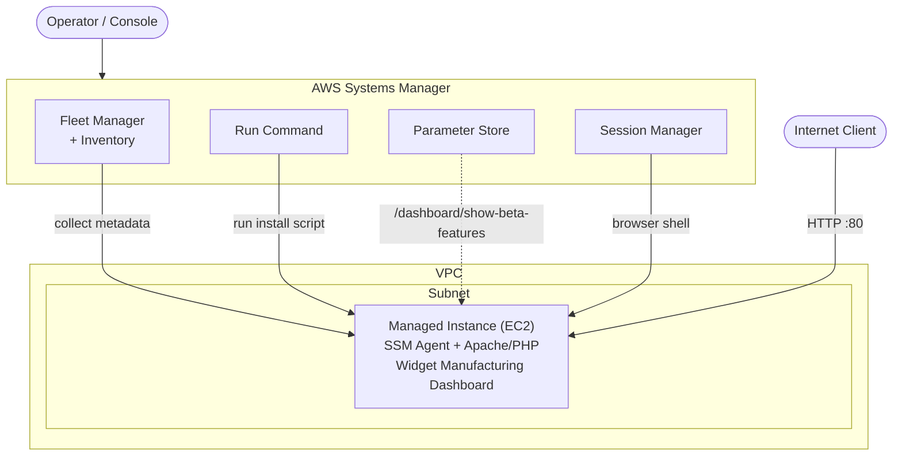

# Using AWS Systems Manager

A hands-on lab where I used **AWS Systems Manager** to manage an EC2 instance without ever using SSH. I inventoried a managed instance, installed a custom web application remotely, managed application settings, and opened a shell on the instance, all from the Systems Manager console.

## Overview

Systems Manager is a collection of capabilities for centralizing operational data and automating tasks across AWS resources. In this lab I worked with four of those capabilities against a single managed EC2 instance running the **Widget Manufacturing Dashboard** web app:

- **Fleet Manager / Inventory** to collect OS, application, and configuration metadata
- **Run Command** to install and configure software remotely
- **Parameter Store** to manage application configuration and secrets
- **Session Manager** for secure, auditable, browser-based shell access

## Architecture

A single EC2 instance (the *Managed Instance*) sits inside a VPC with the **SSM Agent** installed and registered to the Systems Manager service. I drove all management from the Systems Manager console, with no inbound SSH ports, bastion hosts, or SSH keys required.



## Skills Demonstrated

- Collecting software and configuration inventory with **Fleet Manager** and **Inventory**
- Remotely installing applications with **Run Command** (no SSH)
- Managing application configuration and feature flags with **Parameter Store**
- Secure, auditable shell access with **Session Manager**
- Understanding the role of the **SSM Agent** and IAM in managing instances at scale

## Tasks

### Task 1: Generate inventory lists for managed instances

I used **Fleet Manager** to gather inventory from the EC2 instance by creating an inventory association.

- I created an association named `Inventory-Association` targeting the managed instance manually.
- Once it was set up, **Inventory** began regularly collecting software and settings metadata from the instance.
- I reviewed the installed applications under the node's **Inventory** tab.

> Inventory let me review and validate software configurations on the instance without connecting via SSH, and it lets you query which instances match (or violate) your software policy.

### Task 2: Install a custom application using Run Command

I installed the **Widget Manufacturing Dashboard** web app using **Run Command** and a custom document (`Install Dashboard App`).

- I selected the document under **Owner**, then **Owned by me**.
- I targeted the managed instance manually. Instances can also be targeted by **tags**, which lets you run one command across a whole fleet.
- I disabled the S3 output bucket option and ran the command.
- The install script installed **Apache**, **PHP**, the **AWS SDK**, and the web application, then started the web server.
- After about 1 to 2 minutes the overall status changed to **Success**.
- I validated the install by browsing to the instance's public IP (`ServerIP`), and the dashboard loaded.

> Run Command also exposes the equivalent **AWS CLI command**, which I could script for automation instead of using the console.

### Task 3: Use Parameter Store to manage application settings

I used **Parameter Store** to toggle a "dark feature" in the running application.

| Field | Value |
|---|---|
| Name | `/dashboard/show-beta-features` |
| Description | Display beta features |
| Tier | Standard (default) |
| Type | String (default) |
| Value | `True` |

- The application automatically checks Parameter Store for this hierarchical parameter.
- After I created it and refreshed the dashboard, a **third (beta) chart** appeared.
- Deleting the parameter and refreshing hides the chart again.

> This showed me how externalized configuration and feature flags work. You can install features "dark" and activate them later through config, with no redeploy. Parameter Store supports plain-text or encrypted values referenced by a unique hierarchical name such as `/dashboard/<option>`.

### Task 4: Use Session Manager to access instances

I used **Session Manager** to open an interactive browser-based shell on the instance.

```bash
# List the installed application files
ls /var/www/html

# Derive the region from instance metadata, then describe EC2 instances
AZ=`curl -s http://169.254.169.254/latest/meta-data/placement/availability-zone`
export AWS_DEFAULT_REGION=${AZ::-1}
aws ec2 describe-instances
```

- `ls /var/www/html` showed the application files installed by Run Command.
- `aws ec2 describe-instances` returned the instance details in JSON.
- I used no SSH at all, and the instance's security group can keep the SSH port fully closed.

> Session Manager gave me secure, one-step, cross-platform shell access with no inbound ports, bastion hosts, or SSH keys. Access can be restricted with **IAM policies**, and all sessions are logged in **AWS CloudTrail** for auditing.

## Key Takeaways

- **I can manage instances without SSH.** Run Command and Session Manager remove the need for open inbound ports, bastion hosts, and SSH key management.
- **It scales.** Targeting by tags lets a single command run across an entire fleet of matching instances.
- **Inventory drives compliance.** Fleet Manager and Inventory make it easy to see which instances match required software and configuration policies.
- **Externalized config and feature flags are powerful.** Parameter Store let the application read configuration and toggle features at runtime with no redeploy.
- **Security and auditability come built in.** IAM controls access and CloudTrail records it, which gives stronger security and auditing than traditional SSH.
